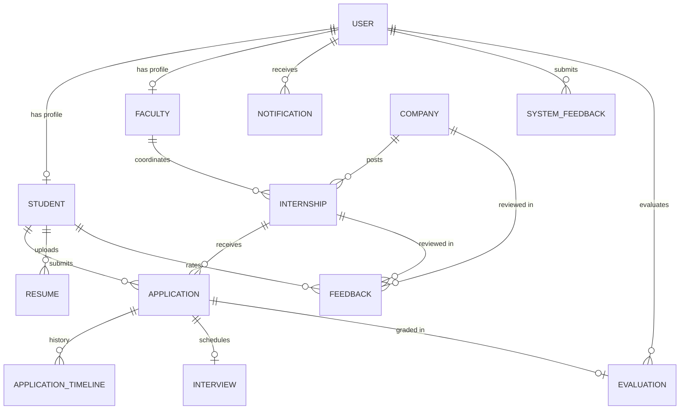

# College Internship Management System (CIMS) - Database Design

The College Internship Management System uses **MySQL** as its primary relational database management system, configured and managed through **Prisma ORM**.

## Relational Architecture & ER Diagram

---

## Normalized Database Entities

### 1. `User` Table
Maintains identity, hashed passwords, roles, and status flags.
- `id`: `INT AUTO_INCREMENT PRIMARY KEY`
- `email`: `VARCHAR(191) UNIQUE NOT NULL`
- `passwordHash`: `VARCHAR(191) NOT NULL` (Bcrypt)
- `role`: `ENUM('ADMIN', 'FACULTY', 'STUDENT') NOT NULL DEFAULT 'STUDENT'`
- `isActive`: `BOOLEAN NOT NULL DEFAULT TRUE`
- `isVerified`: `BOOLEAN NOT NULL DEFAULT TRUE`
- `verificationToken`: `VARCHAR(191) NULL`
- `resetPasswordToken`: `VARCHAR(191) NULL`
- `resetPasswordExpires`: `DATETIME NULL`
- `createdAt`: `DATETIME DEFAULT CURRENT_TIMESTAMP`
- `updatedAt`: `DATETIME ON UPDATE CURRENT_TIMESTAMP`
- **Indexes:** `idx_user_email`, `idx_user_role`

### 2. `Student` Table
Student academic credentials, contact info, and GPA.
- `id`: `INT AUTO_INCREMENT PRIMARY KEY`
- `userId`: `INT UNIQUE NOT NULL` (FK to `User.id` ON DELETE CASCADE)
- `name`: `VARCHAR(191) NOT NULL`
- `phone`: `VARCHAR(191) NOT NULL` (10-15 digits validated)
- `department`: `VARCHAR(191) NOT NULL`
- `GPA`: `DOUBLE NOT NULL` (0.00 to 4.00 range validated)
- `resume`: `VARCHAR(191) NULL`
- `createdAt`, `updatedAt`: Timestamps
- **Indexes:** `idx_student_department`, `idx_student_gpa`

### 3. `Faculty` Table
Academic faculty advisors and departmental mentors.
- `id`: `INT AUTO_INCREMENT PRIMARY KEY`
- `userId`: `INT UNIQUE NOT NULL` (FK to `User.id` ON DELETE CASCADE)
- `name`: `VARCHAR(191) NOT NULL`
- `department`: `VARCHAR(191) NOT NULL`
- `phone`: `VARCHAR(191) NOT NULL`
- `createdAt`, `updatedAt`: Timestamps

### 4. `Company` Table
Accredited employer organizations.
- `id`: `INT AUTO_INCREMENT PRIMARY KEY`
- `name`: `VARCHAR(191) NOT NULL`
- `registrationNumber`: `VARCHAR(191) UNIQUE NOT NULL`
- `location`: `VARCHAR(191) NOT NULL`
- `contactPerson`: `VARCHAR(191) NOT NULL`
- `email`: `VARCHAR(191) NOT NULL`
- `phone`: `VARCHAR(191) NOT NULL`
- `description`: `TEXT NOT NULL`
- `status`: `ENUM('active', 'pending', 'archived') NOT NULL DEFAULT 'active'`
- `createdAt`, `updatedAt`: Timestamps

### 5. `Internship` Table
Corporate and institutional internship postings.
- `id`: `INT AUTO_INCREMENT PRIMARY KEY`
- `companyId`: `INT NOT NULL` (FK to `Company.id` ON DELETE CASCADE)
- `facultyId`: `INT NULL` (FK to `Faculty.id` ON DELETE SET NULL)
- `title`: `VARCHAR(191) NOT NULL`
- `description`: `TEXT NOT NULL`
- `domain`: `VARCHAR(191) NOT NULL`
- `duration`: `VARCHAR(191) NOT NULL` (e.g., '12 weeks')
- `durationWeeks`: `INT NOT NULL` (4 to 26 weeks validated)
- `stipend`: `DOUBLE NOT NULL DEFAULT 0.0`
- `location`: `VARCHAR(191) NOT NULL DEFAULT 'Remote'`
- `startDate`: `DATETIME NOT NULL`
- `endDate`: `DATETIME NOT NULL`
- `applicationDeadline`: `DATETIME NOT NULL`
- `status`: `ENUM('draft', 'pending_approval', 'approved', 'active', 'closed', 'archived')`
- `createdAt`, `updatedAt`: Timestamps
- **Indexes:** `idx_internship_companyId`, `idx_internship_domain`, `idx_internship_status`, `idx_internship_stipend`

### 6. `Application` Table
Candidate applications submitted by students.
- `id`: `INT AUTO_INCREMENT PRIMARY KEY`
- `studentId`: `INT NOT NULL` (FK to `Student.id` ON DELETE CASCADE)
- `internshipId`: `INT NOT NULL` (FK to `Internship.id` ON DELETE CASCADE)
- `resume`: `VARCHAR(191) NOT NULL` (PDF URL)
- `coverLetter`: `TEXT NOT NULL`
- `qualifications`: `TEXT NOT NULL`
- `status`: `ENUM('pending', 'shortlisted', 'rejected', 'accepted', 'withdrawn') DEFAULT 'pending'`
- `appliedAt`: `DATETIME DEFAULT CURRENT_TIMESTAMP`
- `updatedAt`: `DATETIME ON UPDATE CURRENT_TIMESTAMP`
- **Unique Constraint:** `@@unique([studentId, internshipId])` prevents duplicate applications at the database level.

### 7. `ApplicationTimeline` Table
Full audit trail of status transitions.
- `id`: `INT AUTO_INCREMENT PRIMARY KEY`
- `applicationId`: `INT NOT NULL` (FK to `Application.id` ON DELETE CASCADE)
- `status`: `ENUM(...) NOT NULL`
- `comments`: `TEXT NULL`
- `actionBy`: `VARCHAR(191) NULL`
- `createdAt`: `DATETIME DEFAULT CURRENT_TIMESTAMP`

### 8. `Interview` Table
Formal technical or HR interview schedules.
- `id`: `INT AUTO_INCREMENT PRIMARY KEY`
- `applicationId`: `INT UNIQUE NOT NULL` (FK to `Application.id` ON DELETE CASCADE)
- `interviewDate`: `DATETIME NOT NULL` (Enforces >= 24h advance notice)
- `interviewer`: `VARCHAR(191) NOT NULL`
- `interviewMode`: `VARCHAR(191) NOT NULL DEFAULT 'Online / Video Call'`
- `meetingLink`: `VARCHAR(191) NULL`
- `result`: `ENUM('pending', 'passed', 'failed', 'rescheduled') DEFAULT 'pending'`
- `comments`: `TEXT NULL`
- `status`: `ENUM('scheduled', 'completed', 'cancelled', 'rescheduled') DEFAULT 'scheduled'`

### 9. `Evaluation` Table
Detailed performance evaluation across 6 criteria.
- `id`: `INT AUTO_INCREMENT PRIMARY KEY`
- `applicationId`: `INT UNIQUE NOT NULL` (FK to `Application.id` ON DELETE CASCADE)
- `evaluatorId`: `INT NOT NULL` (FK to `User.id` ON DELETE CASCADE)
- `technicalSkills`: `INT NOT NULL` (1 to 5)
- `softSkills`: `INT NOT NULL` (1 to 5)
- `punctuality`: `INT NOT NULL` (1 to 5)
- `responsibility`: `INT NOT NULL` (1 to 5)
- `teamwork`: `INT NOT NULL` (1 to 5)
- `learningAbility`: `INT NOT NULL` (1 to 5)
- `overallRating`: `DOUBLE NOT NULL` (1.00 to 5.00)
- `comments`: `TEXT NOT NULL`

### 10. `Feedback` Table
Student reviews of company culture and mentorship.
- Ratings across: `rating`, `companyCulture`, `mentorshipQuality`, `technicalLearning`, `workEnvironment`, `overallExperience` (1 to 5 stars).

### 11. `Resume` Table
Uploaded PDF resumes with metadata (`fileName`, `fileUrl`, `fileSize`, `uploadedAt`).

### 12. `Notification` Table
Real-time user alerts for status changes, upcoming interviews, and evaluations.

### 13. `SystemFeedback` Table
Bug reports and feature requests submitted to institutional administrators.
